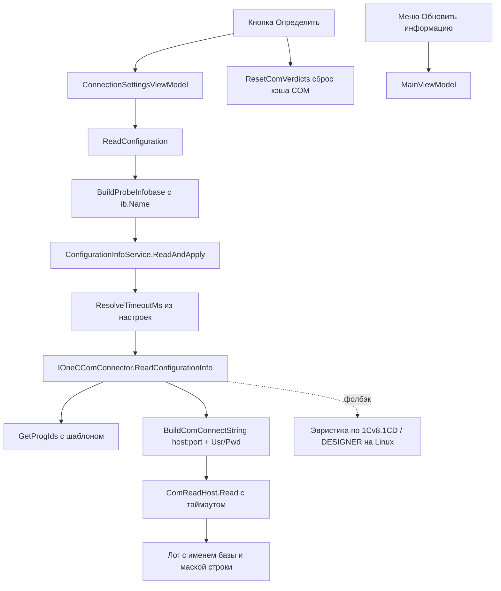

# План исправления issue #174 «Кнопка определения свойств конфигурации»

Версия программы на момент планирования: **0.3.6.97**. Рабочая ветка: `main`.
Репозиторий: `sivatorov/ConfigurationManagement`, локальная копия — `f:/ya/Yandex.Disk/h/Configuration_Management_linux`.

Цель плана — только issue #174 (остальные 17 открытых issues в этот цикл не входят).
Исполнение (код-правки, комментарий к issue, бамп версии, CHANGELOG/README, сборка exe,
push и релиз) — это **отдельные последующие задачи**, здесь они выделены шагами `[РЕЛИЗ-*]`.

---

## 1. Точный диагноз по двум замечаниям пользователя 7OH

### 1.1. Пустое имя базы «» в сообщении об ошибке

**Корневая причина (найдена в коде):**

Кнопка «Определить» в окне настроек базы выполняет цепочку:

```text
OnDetectConfiguration_Click (ConnectionSettingsWindow.xaml.cs / .Avalonia.cs)
  → _viewModel.ReadConfiguration(progress.SetStage)      // ConnectionSettingsViewModel.cs:795
  → BuildProbeInfobase()                                  // ConnectionSettingsViewModel.cs:773
  → ConfigurationInfoService.ReadAndApply(probeIb, ...)   // ConfigurationInfoService.cs:154
  → TryRead → IOneCComConnector.ReadConfigurationInfo(ib,...)  // OneCComConnector.cs:365
  → при сбое лог: "Не удалось прочитать сведения о конфигурации базы «{ib.Name}»"  // OneCComConnector.cs:441-443
```

[`BuildProbeInfobase()`](Configuration%20Management/ViewModels/ConnectionSettingsViewModel.cs:773)
создаёт `new Infobase { Connection = new ConnectionSettings() }`, заполняет поля соединения
(`Server`, `DatabaseName`, `Port`, `User`, …), но **не присваивает `ib.Name`**. Поэтому в
сообщении об ошибке подставляется пустое имя, хотя `Ref="BUH2"` известно.

**Способ исправления (двухуровневый):**

1. Основной: в [`BuildProbeInfobase()`](Configuration%20Management/ViewModels/ConnectionSettingsViewModel.cs:773)
   проставить осмысленное имя базы:
   - приоритет — поле `Name` ViewModel (наименование из настроек);
   - фолбэк — `DatabaseName` (значение `Ref`);
   - фолбэк — `SuggestNameFromPath(FilePath)` для файловой базы.
2. Страховочный: в точке записи лога [`OneCComConnector.cs:441-443`](Configuration%20Management/Services/OneCComConnector.cs:441)
   и [`OneCComConnector.cs:329`](Configuration%20Management/Services/OneCComConnector.cs:329)
   использовать защитный `DisplayName(ib)` — если `ib.Name` пуст, показывать `Ref`/`DatabaseName`
   или `FilePath`, а иначе маркер `<без имени>`. Это закрывает случай, когда имя не задано и у
   реальных баз списка (например, после импорта).

> Диагностическая сводка по 1.1:
> **Симптом** → `...базы «»: Превышен таймаут чтения...`
> **Причина** → probe-база без `ib.Name`.
> **Правка** → передавать/выводить реальное имя (см. выше).

### 1.2. Таймаут 8000 мс на localhost при работающем COM в 1С

**Наблюдение:** сообщение `Превышен таймаут чтения (8000 мс)` даже для `Srvr="localhost:27541";Ref="BUH2"`,
хотя в конфигураторе 1С подключение работает, а COM-коннектор зарегистрирован.

**Причины и решение:**

1. **Таймаут зашит в 8000 мс** как значение по умолчанию во всех уровнях чтения:
   - [`ConfigurationInfoService.TryRead`](Configuration%20Management/Services/ConfigurationInfoService.cs:39)
     (дефолт 8000),
   - [`ReadAndApply`](Configuration%20Management/Services/ConfigurationInfoService.cs:154),
   - [`OneCComConnector.ReadConfigurationInfo`](Configuration%20Management/Services/OneCComConnector.cs:365),
   - [`ConnectionSettingsViewModel.ReadConfiguration`](Configuration%20Management/ViewModels/ConnectionSettingsViewModel.cs:795).
   Первый COM-`Connect` к клиент-серверной базе часто превышает 8 с: холодный старт сервера,
   обращение к серверу лицензий (HASP), первичное создание сеанса под пользователем
   `Usr="Абдулов (директор)"`. Повысить до значения по умолчанию и сделать настраиваемым.

2. **ProgID уже выбирается корректно** (с учётом шаблона из issue #175 и первого
   зарегистрированного кандидата через `FirstRegisteredProgId`). Правки здесь не требуются,
   но полезно сохранить диагностику `LastUsedProgId/LastUsedPlatformVersion`.

3. **Строка подключения с портом строится верно**: [`GetServerWithPort()`](Configuration%20Management/Models/ConnectionSettings.cs:68)
   не дублирует порт, если он уже встроен в `Server` (проверка `server.Contains(':')`), и добавляет
   `host:port` только для нестандартного порта. Формат `Srvr="localhost:27541"` корректен для 1С.
   Дополнительная правка не нужна; добавляем лишь **фолбэк-подсказку** при ошибке (см. п.4 ниже).

**Решение по таймауту:**

- Ввести настройку `ComDetectTimeoutMs` (в `AppSettings`), значение по умолчанию **30000 мс**
  (30 с — разумный компромисс: чтение происходит только по явной команде, поэтому долгий
  таймаут не мешает старту). Минимум — 1000, шаг регулируется в UI.
- Прокачать это значение через всю цепочку явного чтения, чтобы оно реально доходило до
  `ComReadHost.Read(connectString, timeoutMs, ...)` (там уже есть дедлайн `timeoutMs + AgentGraceMs`,
  то есть увеличение таймаута напрямую снимает проблему).
- Защитное логирование: при неудаче дополнительно к маскированной строке подключения выводить
  фактический `LastUsedProgId` и применённый таймаут — чтобы следующий отчёт пользователя был
  самодостаточным.

> Диагностическая сводка по 1.2:
> **Симптом** → таймаут 8 с на localhost при рабочем COM.
> **Причина** → жёсткий дефолт 8000 мс + длительный первый `Connect`.
> **Правка** → настраиваемый `ComDetectTimeoutMs` (по умолчанию 30000) и прокачка его до агента.

### 1.3. Автоматическое чтение свойств при импорте/старте

**Текущее состояние (проверено по коду):** автоматическое чтение **уже отсутствует**:

- [`CompleteStartupInitializationAsync()`](Configuration%20Management/ViewModels/MainViewModel.Tools.cs:1150)
  при старте НЕ вызывает `RefreshConfigurationInfoAsync` (комментарий прямо фиксирует это для issue #174).
- У метода [`RefreshConfigurationInfoAsync()`](Configuration%20Management/ViewModels/MainViewModel.Tools.cs:869)
  **нет ни одного вызывающего** — это мёртвый код, остатки прежнего фонового автодочитывания.
- В импортёрах (`IbasesV8iImporter`, `StartManagerImporter`) нет вызовов `TryApply`/`ReadAndApply`.
- Единственные активные точки чтения — **только явные команды**:
  - `RefreshConfigurationInfo` (контекстное меню «Обновить информацию»): Tools.cs:923 и Avalonia.cs:3915;
  - кнопка «Определить»: `DetermineConfiguration`/`ReadConfiguration`.

**Действие:** гарантировать отсутствие авто-чтения и опционально дать пользователю переключатель
(по умолчанию выключен). Рекомендуется:
- **Вариант A (минимальный, рекомендуемый):** удалить мёртвый `RefreshConfigurationInfoAsync` вместе
  с полем `_configInfoFailedKeys` и вспомогательным `ConfigInfoKey`, чтобы исключить соблазн
  повторно подключить фоновое дочитывание. Явные команды оставить.
- **Вариант B (если хочется настройку):** добавить флаг `AutoDetectConfigInfoEnabled` (по умолчанию
  `false`) в `AppSettings` и чекбокс в окне настроек; `RefreshConfigurationInfoAsync` вызывать только
  из старта/импорта при включённом флаге. По умолчанию выключено — требование пользователя выполнено.

В этом плане принят **Вариант A**, как минимально рискованный и точно соответствующий требованию
«отсутствовала»; Вариант B описан как запасной.

---

## 2. Архитектура решения и поток данных



Ключевые инварианты, которые надо сохранить при правках:
- COM-вызовы только в процессе-агенте `ComReadHost` (не в основном процессе — fast-fail 0xC0000409).
- Пароль в лог не попадает: только через `MaskCredentials` (правило из issue #174).
- Чтение не блокирует UI: всегда через `Task.Run` + диалог прогресса / Dispatcher.
- На Linux COM недоступен — используется `OneCComConnector.Linux` (эвристика + `DESIGNER /DumpCfg`).

---

## 3. Перечень изменяемых файлов и функций (со строками)

> Номера строк даны по текущей рабочей копии; перед правкой уточнить точные границы блоков.

### 3.1. Имя базы «» — обязательные правки

| Файл | Функция / место | Строки | Что сделать |
|---|---|---|---|
| `ViewModels/ConnectionSettingsViewModel.cs` | `BuildProbeInfobase()` | 773–787 | Проставить `ib.Name` (приоритет `Name` → `DatabaseName` → `SuggestNameFromPath`). |
| `Services/OneCComConnector.cs` | тело `ReadConfigurationInfo`, запись лога | 441–443 | Использовать защитный `DisplayName(ib)` вместо голого `ib.Name`. |
| `Services/OneCComConnector.cs` | тело `Connect`, запись лога | 329 | Там же подставить `DisplayName(infobase)` (единообразие). |
| `Services/OneCComConnector.cs` | новый private static helper | (после 907) | Добавить `DisplayName(Infobase ib)`: `Name` → `Connection.DatabaseName`/`Ref` → `Connection.FilePath` → `<без имени>`. |

### 3.2. Настраиваемый таймаут — обязательные правки

| Файл | Функция / место | Строки | Что сделать |
|---|---|---|---|
| `Models/AppSettings.cs` | новое свойство | после 125 | Добавить `public int ComDetectTimeoutMs { get; set; } = 30000;` (минимальное 1000). |
| `Services/ConfigurationInfoService.cs` | `TryRead`, `ReadAndApply` | 39, 154 | Сигнатуру `int? timeoutMs = null`; резолвить значение из настроек, если null. |
| `Services/ConfigurationInfoService.cs` | `TryApply` | 88–113 | Передавать в `TryRead` резолвнутый таймаут (или принимать параметр). |
| `Services/ConfigurationInfoService.cs` | новый helper | (в конце) | `ResolveTimeoutMs(int? requested)` — читает `AppServices`/`IInfobaseRepository` настройку `ComDetectTimeoutMs`. |
| `Services/OneCComConnector.cs` | `ReadConfigurationInfo` | 365 | Логировать фактически применённый таймаут в диагностике неудачи. |
| `Services/ComReadHost.cs` | `Read` | 225 | Уже принимает `timeoutMs`; дедлайн `timeoutMs + AgentGraceMs` на строке 291 — менять не нужно, таймаут приходит сверху. |
| `ViewModels/ConnectionSettingsViewModel.cs` | `ReadConfiguration` | 795–799 | Передавать резолвнутый таймаут из настроек вместо жёсткого 8000. |
| `ViewModels/MainViewModel.Tools.cs` | `RefreshConfigurationInfo` | 923–976 | Передавать резолвнутый таймаут (если остаётся явная команда). |
| `ViewModels/MainViewModel.Avalonia.cs` | `RefreshConfigurationInfo` | 3915–3949 | То же для Linux/Avalonia. |

### 3.3. Отключение авто-чтения — правки (Вариант A)

| Файл | Функция / место | Строки | Что сделать |
|---|---|---|---|
| `ViewModels/MainViewModel.Tools.cs` | `RefreshConfigurationInfoAsync` | 869–908 | Удалить метод (мёртвый код). |
| `ViewModels/MainViewModel.Tools.cs` | `_configInfoFailedKeys`, `ConfigInfoKey` | 874, 888, 892, 914–917, 935 | Удалить связанные поле/хелпер и их использования. |

### 3.4. UI-настройка таймаута (Windows/WPF и Linux/Avalonia)

| Файл | Место | Строки | Что сделать |
|---|---|---|---|
| `Views/SettingsWindow.xaml.cs` | метод сохранения настроек | 272–274 | Добавить сохранение `ComDetectTimeoutMs` из нового поля. |
| `Views/SettingsWindow.xaml.cs` | инициализация | 64–67 | Показывать текущее значение таймаута. |
| `Views/SettingsWindow.Avalonia.cs` | сохранение/чтение | 339–341, 2436–2438 | То же для Avalonia. |
| `Views/SettingsWindow.xaml` | разметка | (около блока шаблона COM) | Добавить поле «Таймаут определения свойств (мс)». |
| `Views/SettingsWindow.Avalonia.cs` (разметка) | — | — | Аналогичное поле в Avalonia-разметке. |
| `Localization` ресурсы | ключи | — | Добавить/переиспользовать ключи для подписи поля и валидации. |

---

## 4. Диагнозы COM: фолбэки и подсказки

- **ProgID**: перебор `GetProgIds` с шаблоном (`ComConnectorNameTemplate`) и первым
  зарегистрированным кандидатом (`FirstRegisteredProgId`) уже реализован. Менять порядок не нужно.
- **Строка подключения**: формат `host:port` корректен; `GetServerWithPort()` защищён от дубля порта.
  Правок не требуется, но при неудаче в диалоге/логе дополнительно выводить `LastUsedProgId` и
  применённый таймаут.
- **Фолбэки чтения**:
  - Windows: COM (`ComReadHost`) → эвристика по `1Cv8.1CD` (в `ConfigurationInfoService.TryRead`).
  - Linux: эвристика по файлу → `DESIGNER /DumpCfg` (в `OneCComConnector.Linux`).
- **Сессионная защёлка COM**: сохранить оба сброса вердиктов (`ResetComVerdicts`) в точках явного
  запуска (кнопка «Определить» и «Обновить информацию») — уже реализовано, не трогать.

---

## 5. Проверка на обеих платформах

### 5.1. Windows/WPF
- Собрать `build-windows-single-file.ps1` (WPF, CoreCLR). COM-чтение идёт через `ComReadHost`.
- Проверить кнопку «Определить» на:
  - клиент-серверной базе с нестандартным портом (`localhost:27541`) — реальный кейс пользователя;
  - файловой базе (эвристика + COM);
  - веб-базе (COM неприменим → аккуратный отказ без зависания).
- Проверить, что имя базы в сообщении об ошибке не пустое (при недоступной базе).
- Проверить, что повышенный/настроенный таймаут применяется (замерить время до отказа при
  недоступном сервере).
- Проверить маскирование пароля в логе (негативный тест с паролем).

### 5.2. Linux/Avalonia
- Собрать `build-linux-single-file.sh` (Avalonia). COM недоступен — проверяется путь эвристики и
  `DESIGNER /DumpCfg`.
- Кнопка «Определить» на файловой и клиент-серверной базе (через конфигуратор).
- Отсутствие таймаут-блокировок UI (всё в фоне).
- Поле настройки таймаута доступно и сохраняется.

### 5.3. Сквозные проверки
- При старте и при импорте из файла баз **не** должно быть фоновых COM-чтений (в логе нет строк
  `Не удалось прочитать сведения...` без явной команды).
- После удаления `RefreshConfigurationInfoAsync` проект собирается без предупреждений о неиспользуемом коде.

---

## 6. План тестирования (чек-лист)

1. **Пустое имя** — недоступная клиент-серверная база, кнопка «Определить»: в логе имя базы
   присутствует (не «»). (Windows + Linux)
2. **Таймаут** — недоступный `localhost:нестандартный_порт`: при значении 30000 мс чтение
   завершается отказом только после ~30 с, а не после 8 с. (Windows)
3. **Успешное чтение** — доступная база через COM (Windows) и через `DESIGNER` (Linux): имя и
   версия заполняются, поля обновляются.
4. **Настройка таймаута** — меняется в окне настроек, сохраняется, применяется при следующем
   чтении (обе платформы).
5. **Нет авто-чтения** — импорт из `ibases.v8i` и старт приложения не порождают COM-попыток
   (отсутствуют строки `Не удалось прочитать...` без явного действия).
6. **Маскирование** — в логе строка подключения с паролем выводится как `Pwd=***`/скрыта.
7. **Регрессия** — заведомо рабочие сценарии: открытие настроек базы, «Обновить информацию» из
   контекстного меню (Windows Tools.cs и Linux Avalonia.cs), нормальная сборка WPF и Avalonia.

---

## 7. Последующие шаги (выполняются отдельными задачами)

> Эти шаги НЕ входят в код-правки issue #174, а идут после них.

- **[РЕЛИЗ-1]** Внести код-правки по п.3, проверить по чек-листу п.6.
- **[РЕЛИЗ-2]** Написать комментарий к issue #174 (что исправлено, как диагностировать, какие
  настройки появились).
- **[РЕЛИЗ-3]** Бумп версии (текущая 0.3.6.97 → следующая) в `CHANGELOG.md`, `_release/<версия>.md`
  и файлах версии.
- **[РЕЛИЗ-4]** Обновить `CHANGELOG.md` и `README.md` (описание кнопки «Определить», настройка таймаута).
- **[РЕЛИЗ-5]** Собрать exe для Windows (`build-windows-single-file.ps1`) и Linux (`build-linux-single-file.sh`).
- **[РЕЛИЗ-6]** `git push` ветки `main`, выпустить релиз с тегом.