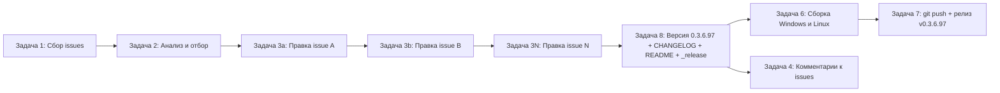

# План: обработка открытых issues, исправление, сборка и релиз 0.3.6.97

**Репозиторий**: `sivatorov/ConfigurationManagement` (ветка `main`)
**Проект**: C#/.NET 10, двухплатформенный: WPF (`net10.0-windows`, символ `WINDOWS`) + Avalonia 11 (`net10.0`, символ `LINUX`). Linux-сборка из Windows — через `-p:ForceLinux=true`.
**Текущая версия**: `0.3.6.96` (4 поля в `Configuration Management.csproj`: строки 62–65).
**Целевая версия**: `0.3.6.97` (одна версия, один релиз на всю партию issues — решение пользователя).

> Этот документ — **архитектурный/организационный план**. Каждый пункт из раздела
> «Декомпозиция» выполняется как **отдельная новая задача** через `new_task`
> в соответствующем режиме. Точные правки по каждому issue уточняются исполнителем
> задачи по факту анализа конкретных issues и комментариев.

---

## 1. Контекст и инварианты (для всех задач)

1. Перед началом каждого прогона — `git status`; рабочее дерево должно быть чистым.
2. Версия **живёт только в четырёх полях `Configuration Management.csproj`**
   (`<Version>`, `<AssemblyVersion>`, `<FileVersion>`, `<InformationalVersion>`).
   - `AssemblyInfo.cs` (только `ThemeInfo`) — **не трогать**.
   - `VersionInfo.cs` (читает версию из атрибутов сборки) — **не трогать**.
3. Стратегия версии — **групповая**: все отобранные issues закрываются в **одной**
   версии `0.3.6.97` и **одном** релизе `v0.3.6.97`. Версия поднимается **один раз**
   в конце, после внесения всех правок.
4. Формат записей — Keep a Changelog (см. шапку `CHANGELOG.md`): раздел
   `## [0.3.6.97] — <дата>` вверху списка, описание каждого исправления со ссылкой
   на номер issue и файлы.
5. После каждой правки кода обе платформы обязаны собираться:
   - Windows: `dotnet build "Configuration Management/Configuration Management.csproj" -c Release`
   - Linux (кросс из Windows): `dotnet build "Configuration Management/Configuration Management.csproj" -c Release -p:ForceLinux=true`
6. Артефакты сборки (`dist/`, `publish/`), временные файлы анализа (`_analysis/`,
   `_uncommitted.diff`, `*.json` с дампом issues) — **вне git** (см. `.gitignore` /
   `.codeassistantignore`). В репозиторий попадают только код, документы и заметки `_release/`.
7. Все команды `gh` — от учётной записи `sivatorov`.

---

## 2. Определение текущей версии и формирование номера новой

### Как определить текущую версию
- Источник истины: `<Version>` в [`Configuration Management.csproj`](Configuration%20Management/Configuration%20Management.csproj:62) (строка 62).
- Сверка: бейдж `README.md` (строка 3), верхняя запись `CHANGELOG.md` (раздел `[0.3.6.96]`),
  последняя заметка `_release/0.3.6.96.md`. Все четыре должны совпадать.
- Команда: `findstr "Version" "Configuration Management\Configuration Management.csproj"` (cmd)
  или grep по строке `<Version>`.

### Как формировать номер новой версии
- Схема `MAJOR.MINOR.PATCH.BUILD` (4 части), где `BUILD` = микро-версия исправления.
- При групповой стратегии: `0.3.6.96 → 0.3.6.97` — **инкремент только последней части**.
- Правило: новое значение одинаково во всех 4 полях csproj, в бейдже README,
  в разделе CHANGELOG, в заметке `_release/0.3.6.97.md` и в теге `v0.3.6.97`.
- Если в процессе выяснится, что правка требует новой минорной/мажорной версии —
  согласовать с пользователем отдельно (по умолчанию — только инкремент `BUILD`).

---

## 3. Подключение к GitHub и проверка открытых issues (Задача 1)

**Цель**: получить полный, свежий список открытых issues с описанием и комментариями.

**Команды / инструменты**:
- `gh auth status` — проверить авторизацию (`sivatorov`, токен/PAT).
- Список открытых issues с комментариями:
  ```
  gh issue list --repo sivatorov/ConfigurationManagement --state open \
    --json number,title,state,createdAt,updatedAt,author,body,comments,labels
  ```
- Детали по каждому issue (при необходимости): `gh issue view <номер> --repo sivatorov/ConfigurationManagement --comments`.
- Альтернатива (REST): `GET /repos/sivatorov/ConfigurationManagement/issues?state=open&per_page=100`
  + `GET /repos/sivatorov/ConfigurationManagement/issues/{n}/comments`.

**Выход**: сохранённый JSON-снимок во временный файл вне git, напр. `_analysis/open_issues_full.json`
(каталог `_analysis/` уже в `.codeassistantignore`).

**Критерий готовности**: получен и сохранён полный список открытых issues; доступ к `gh` подтверждён.

---

## 4. Анализ issues по критериям отбора (Задача 2)

**Критерий отбора** (из ТЗ):
- issues **без комментариев** → правка на основе **описания**;
- issues, где **последний комментарий НЕ от `sivatorov`** → ориентироваться на
  **последний комментарий не от меня**;
- issues, где последний комментарий от `sivatorov` → **пропускаются**.

**Действия**:
1. Определить свой логин: `gh api user --jq .login`.
2. Для каждого issue вычислить: `count(comments)==0` **ИЛИ** `last_comment.author != me`.
3. Отфильтровать кандидатов; для каждого указать:
   - базу для правки (описание / последний чужой комментарий);
   - предполагаемую область кода (файлы/подсистема) и платформу (Windows/WPF, Linux/Avalonia, обе);
   - риски неоднозначности (для issues без комментариев).
4. Отдельно пометить issues, где нужен **только ответ-комментарий** без правок
   (по прецеденту `#201`), и issues «на доработку» с длинной историей (по прецеденту `#163`).

**Выход**: файл `_analysis/selected_issues.md` (таблица кандидатов).

**Критерий готовности**: сформирован список отобранных issues с базой для правки и областью кода;
пропущенные issues явно перечислены с причиной.

---

## 5. Внесение исправлений (Задачи 3a…3N — по одному issue на задачу)

**Цикл на каждый отобранный issue** (отдельная новая задача, режим `code`):
1. Прочитать затрагиваемые файлы (`search_files`, `read_file`), найти фактические точки правки.
2. Внести правку в общий код и/или в обе платформенные реализации
   (WPF `.xaml`/`.xaml.cs` и Avalonia `.axaml`/`.Avalonia.cs`), следуя существующим паттернам.
   Если правка требует удаления мёртвых файлов — убедиться, что нет ссылок из другого кода,
   проверить, что `csproj` не перечисляет их явно (SDK-globbing — удаление физических файлов достаточно).
3. Прогнать сборку обеих платформ (см. п. 5 раздела «Контекст и инварианты»).
4. Зафиксировать связь правка ↔ № issue (в сообщении коммита).

**Инструменты**: `dotnet build`, `search_files`, `read_file`, `apply_diff`/`write_to_file`.

**Выход**: код исправлен, обе платформы собираются.

**Критерий готовности**:
- Правка соответствует базе (описанию или последнему чужому комментарию).
- `dotnet build` проходит и для Windows, и для Linux (`-p:ForceLinux=true`).
- Не внесено посторонних изменений (проверка `git diff`).

**Зависимость**: Задача 3a зависит от Задачи 2. Задачи 3b…3N зависят от 3a…(N-1)
только в смысле порядка (чтобы избежать конфликтов правок), но выполняются последовательно
и все завершаются до Задачи 4.

---

## 6. Добавление комментариев к исправленным issues (Задача 4)

**Действия**:
- Для каждого исправленного issue — `gh issue comment <номер> --body "<что исправлено, в какой версии>"`.
- Формат комментария: краткое описание правки + версия, в которой вошло исправление (`0.3.6.97`) +
  ссылка на раздел `CHANGELOG.md` (образец — комментарии из прошлых прогонов, см. `_comment_*.md`).
- После комментария закрыть issue: `gh issue close <номер>` при условии, что правка решает проблему.
- Для issues «ответ-комментарий» (без правок) — только добавить комментарий с пояснением/ссылкой
  на уже вышедшую версию, закрывать по ситуации.

**Критерий готовности**: каждый отобранный/исправленный issue получил комментарий от `sivatorov`
с указанием версии `0.3.6.97`; завершённые issues закрыты.

**Зависимость**: от Задач 3 (фактические правки) и 4/Задачи 8 (финальная версия).
Комментарии ссылаются на `0.3.6.97`, поэтому фактически оформляются после фиксации версии.

---

## 7. Версия, CHANGELOG, README, `_release/` (Задача 8)

**Действия** (выполняется один раз после всех правок):
1. Поднять `Version`, `AssemblyVersion`, `FileVersion`, `InformationalVersion`
   в [`Configuration Management.csproj`](Configuration%20Management/Configuration%20Management.csproj:62)
   (строки 62–65): `0.3.6.96 → 0.3.6.97`.
2. Добавить раздел `## [0.3.6.97] — <дата>` в **верх** `CHANGELOG.md` (Keep a Changelog),
   с описанием каждого исправления, ссылками на issues и файлы (образец — раздел `[0.3.6.96]`).
3. Обновить бейдж версии в `README.md` (строка 3): `Версия-0.3.6.97`; при необходимости —
   другие упоминания.
4. Создать заметку `_release/0.3.6.97.md` по образцу существующих (`_release/0.3.6.96.md`).
5. Прогнать финальную сборку обеих платформ.

**Критерий готовности**: версия согласована во всех местах (csproj, README, CHANGELOG, `_release/`);
раздел CHANGELOG описывает все исправленные issues; обе платформы собираются на финальной версии.

**Зависимость**: от всех Задач 3 (список исправлений).

---

## 8. Сборка single-file исполняемых файлов для Windows и Linux (Задача 6)

**Windows** (хост Windows):
```
cd "Configuration Management"
.\build-windows-single-file.ps1                # Release, RID win-x64
```
Результат: `dist/win-x64/ConfigurationManagement.exe` (единственный `.exe`, самодостаточный).
Проверить: в папке только один `.exe` (скрипт сам удаляет лишнее).

**Linux**:
- Вариант A (реальный Linux/WSL/CI, нативный): `./build-linux-single-file.sh Release`
  → `dist/linux-x64/ConfigurationManagement`.
- Вариант B (кросс с Windows): `FORCE_LINUX=1 ./build-linux-single-file.sh`
  (или `build-linux-single-file.ps1`).
- Вариант C (надёжный, рекомендуется): **полагаться на CI** — [`release.yml`](.github/workflows/release.yml)
  при push тега `v0.3.6.97` собирает Linux на `ubuntu-latest` и прикрепляет asset.
- Проверить: в папке только один бинарник.

**Требования**: .NET SDK 10 (>= 10.0.400); на реальном Linux — системные зависимости Avalonia
(см. шапку `build-linux-single-file.sh`).

**Риск**: кросс-сборка Avalonia с Windows может отличаться от нативной — при проблемах использовать WSL/CI.

**Критерий готовности**: получены `dist/win-x64/ConfigurationManagement.exe` и
`dist/linux-x64/ConfigurationManagement` (или Linux-asset прикреплён CI).

**Зависимость**: от Задачи 8 (финальная версия и код).

---

## 9. Публикация на GitHub и создание релиза (Задача 7)

**Действия**:
1. Проверить, что `dist/`, `publish/`, `_analysis/` не попадут в коммит (`.gitignore`).
2. `git add` (код, csproj, CHANGELOG, README, `_release/0.3.6.97.md`, при необходимости планы);
   осмысленные коммиты с привязкой к № issues (например, «Fix issues #…, bump version to 0.3.6.97»).
3. `git push origin main`.
4. Создать тег: `git tag v0.3.6.97` → `git push origin v0.3.6.97`.
   Push тега запустит CI [`release.yml`](.github/workflows/release.yml), который соберёт и прикрепит
   Linux-asset (перезапишет одноимённый при необходимости).
5. Создать GitHub Release с Windows-артефактом:
   ```
   gh release create v0.3.6.97 \
     "Configuration Management/dist/win-x64/ConfigurationManagement.exe" \
     --title "Управление конфигурациями 1С 0.3.6.97" \
     --notes "$(cat _release/0.3.6.97.md)"
   ```
   Либо создать релиз до push тега (тогда CI его найдёт по тегу и просто добавит Linux-asset).
6. После завершения CI проверить, что к релизу прикреплены **оба** артефакта:
   Windows `.exe` (вручную) и `ConfigurationManagement-linux-x64` (CI).
7. Перепроверить, что все исправленные issues закрыты и прокомментированы.

**Критерий готовности**: изменения запушены в `main`; создан GitHub Release `v0.3.6.97`
с обоими исполняемыми файлами и описанием из `_release/0.3.6.97.md`.

**Зависимость**: от Задачи 6 (артефакты) и Задачи 8 (версия/описание).

---

## 10. Декомпозиция на подзадачи (каждая — отдельная `new_task`)

| № | Задача | Режим | Вход | Выход / критерий готовности |
|---|--------|-------|------|-----------------------------|
| 1 | Подключиться к GitHub, собрать открытые issues | code | репозиторий, `gh auth` | `_analysis/open_issues_full.json`; список получен |
| 2 | Проанализировать issues по критериям отбора | code/ask | список issues | `_analysis/selected_issues.md`; кандидаты определены |
| 3a…3N | Внести исправления по каждому отобранному issue (отдельная задача на issue) | code | выбранные issues | правки кода; обе платформы собираются |
| 4 | Комментарии к исправленным issues (что исправлено, версия 0.3.6.97) | code | правки + версия | комментарии от `sivatorov`; закрытые issues |
| 8 | Поднять версию до 0.3.6.97 + CHANGELOG + README + `_release/0.3.6.97.md` | code | итоговый список правок | согласованная версия, документы обновлены |
| 6 | Сборка single-file Windows и Linux | code | итоговый код | `dist/win-x64/*.exe`, `dist/linux-x64/ConfigurationManagement` (или Linux-asset от CI) |
| 7 | git push + создание GitHub-релиза v0.3.6.97 | code | артефакты, версия, описание | тег, Release с обоими артефактами |

### Порядок и зависимости

- Задача 2 зависит от Задачи 1.
- Задачи 3a…3N зависят от Задачи 2; между собой выполняются последовательно.
- Задача 8 зависит от всех Задач 3 (итоговый список исправлений).
- Задача 4 зависит от Задач 3 и 8 (комментарии ссылаются на версию 0.3.6.97); может идти параллельно с Задачей 6.
- Задача 6 зависит от Задачи 8.
- Задача 7 зависит от Задач 6 и 8.

> Нумерация подзадач в таблице отражает логику, а не порядок создания задач через
> `new_task`. Фактический порядок запуска — согласно графу зависимостей выше.

---

## 11. Риски и митигация

- **Нет авторизации `gh`** → Шаг 1 не выполнится; требуется `gh auth login` или `GITHUB_TOKEN`.
- **Неоднозначность правки** для issues без комментариев (правка по описанию) → риск неверной
  интерпретации; проверить сборку, сопоставить с соседними аналогичными реализациями (WPF↔Avalonia).
- **Кросс-сборка Linux с Windows** может дать иное поведение Avalonia → fallback на WSL/CI (`release.yml`).
- **Конфликт ручного релиза и CI**: `release.yml` срабатывает на тег и перезапишет Linux-asset —
  согласовать порядок (создать тег → CI прикрепит Linux, либо загрузить оба артефакта вручную).
- **Мусор в коммите** (`dist/`, `_analysis/`, дампы issues) → контролировать через `.gitignore`.
- **Регрессии одной платформы** при правке общей логики → обязательная сборка обеих платформ.
- **Расхождение версий** (csproj / CHANGELOG / README / тег / комментарии к issue / `_release/`) →
  вести версию централизованно (Задача 8), перед релизом сверять все места.

---

## 12. Итоговая последовательность для исполнителя-владельца

1. Запустить Задачу 1 (сбор issues) → Задачу 2 (анализ/отбор).
2. По результатам Задачи 2 создать по одной Задаче 3x на каждый отобранный issue.
3. После всех правок — Задача 8 (версия 0.3.6.97, CHANGELOG, README, `_release/`).
4. Задача 4 (комментарии + закрытие issues) и Задача 6 (сборка Windows/Linux).
5. Задача 7 (push, тег `v0.3.6.97`, GitHub Release с обоими артефактами), дождаться завершения CI.