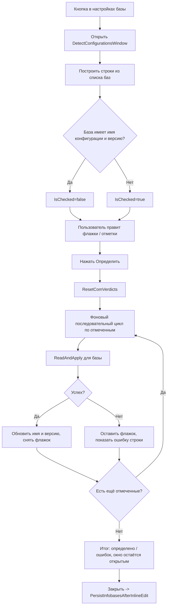

# План реализации issue #236 — «Определение конфигураций всех баз»

Версия приложения: 0.3.7.18 (последний отобранный тикет для правки).
Тикет #175 («шаблон имени COM») уже исправлен в 0.3.7.16, поэтому разбиение списка по COM-коннектору допустимо (требование #5), но ниже показано, почему в текущей инфраструктуре оно нецелесообразно.

---

## 1. Архитектура нового диалога

### Наименования
| Что | Имя | Платформа |
|-----|-----|-----------|
| WPF-разметка | `Views/DetectConfigurationsWindow.xaml` | Windows (WPF) |
| WPF-логика | `Views/DetectConfigurationsWindow.xaml.cs` | Windows (WPF) |
| Avalonia-версия | `Views/DetectConfigurationsWindow.Avalonia.cs` | Linux (Avalonia, строится кодом, `: ModalWindowBase`) |
| Общая строка-модель | `ViewModels/DetectConfigRowViewModel.cs` | общая (обе платформы) |
| Кнопка в настройках | `OnDetectAllConfigurations_Click` | обе платформы |

Класс окна WPF: `DetectConfigurationsWindow : Window`. Avalonia: `DetectConfigurationsWindow : ModalWindowBase` (аналог [`DetectConfigProgressWindow.Avalonia.cs`](Configuration%20Management/Views/DetectConfigProgressWindow.Avalonia.cs:18)). Паттерн табличного диалога с флажками и состоянием строк берётся из [`CacheCleanWindow.Avalonia.cs`](Configuration%20Management/Views/CacheCleanWindow.Avalonia.cs:26) (словарь `CheckBox ↔ Infobase`, кнопки «отметить все / снять все / инверсия», подсчёт отмеченных).

### Место в настройках и кнопка
Добавить кнопку «Определить\обновить конфигурации всех баз» в блок **«Экспорт / загрузка списка баз»** вкладки «ibases.v8i», рядом с импортом из ibases.v8i:

- **WPF**: в [`SettingsWindow.xaml`](Configuration%20Management/Views/SettingsWindow.xaml:1591) в `<GroupBox Header="{loc:Loc Settings.IbaseList}">` после кнопки «Импорт из ibases.v8i» (строка 1619). Кнопка стилем `SecondaryButton`, иконка `PackIcon Kind="..."` (предложить `Kind="AutoRenew"`/`"Scan"`/`"MagnifyScan"`), подпись и тултип локализованы.
- **Avalonia**: в [`SettingsWindow.Avalonia.cs`](Configuration%20Management/Views/SettingsWindow.Avalonia.cs:1853) в панель `listButtons` (после `importV8i`, строка 1869): `new Button { Content = T("Settings.Bases.DetectAllConfigs") }` + `ToolTip.SetTip(...)` + `Click += ...`.

### Разметка окна (колонки таблицы)
| Колонка | Ширина | Источник данных |
|---------|--------|-----------------|
| Флажок (заголовок — счётчик «Выбрано: N») | автоподбор | `DetectConfigRowViewModel.IsChecked` |
| Имя базы | растягиваемая | `ib.Name` |
| Текущая конфигурация | растягиваемая | `ib.ConfigurationName` |
| Номер релиза (версия) | автоподбор | `ib.ConfigurationVersion` |

Панель управления (требование #3): три кнопки — «Отметить все», «Снять все», «Инвертировать». Нижняя панель: кнопка «Определить» (основная) и «Закрыть».

---

## 2. Получение списка баз и начальное состояние флажков

### Откуда список
- **Windows**: `MainViewModel.Infobases` — `ObservableCollection<Infobase>`. В обработчике `OnDetectAllConfigurations_Click` передать `_viewModel.Infobases.ToList()` в конструктор диалога.
- **Avalonia**: `MainViewModel.Infobases` — `IReadOnlyList<Infobase>` (см. [`MainViewModel.Avalonia.cs`](Configuration%20Management/ViewModels/MainViewModel.Avalonia.cs:4462)). Передать `.ToList()`.

Диалог получает список `IReadOnlyList<Infobase>`, оборачивает каждую базу в `DetectConfigRowViewModel` (ссылка на тот же объект `Infobase`, чтобы правки конфигурации сразу отражались в модели и сохранялись).

### Определение уже заданной конфигурации/релиза (требование #2)
Текущие значения — это напрямую поля `ib.ConfigurationName` и `ib.ConfigurationVersion` (модель [`Infobase.cs`](Configuration%20Management/Models/Infobase.cs:178)). Никакого отдельного запроса не требуется.

### Начальное состояние флажка
- База, у которой **уже заполнены и имя конфигурации, и номер релиза** → `IsChecked = false` (требование #2: не проставляется автоматически).
- База, у которой **хотя бы одно поле пусто** (нет имени конфигурации или нет версии) → `IsChecked = true` по умолчанию (это целевые базы для «Определить»). Это согласуется с политикой ручного ввода issue #164: перезаписывать можно только явной командой пользователя.
- После построения строк обновить заголовок флажка (счётчик отмеченных).

> Альтернативная трактовка требования (все флажки по умолчанию сняты) допустима; рекомендуется автоотметка незаполненных баз, т.к. именно они нужны для определения. Решение зафиксировать в реализации и при необходимости уточнить у владельца тикета.

---

## 3. Выполнение определения свойств

### Последовательно, а не параллельно (требование #5)
Требование #5 разрешает разбиение списка по COM-коннектору («допустимо»), но фактическое ускорение невозможно в текущей инфраструктуре:

- Чтение идёт через [`ComReadHost.Read()`](Configuration%20Management/Services/ComReadHost.cs:225), который сериализуется статической блокировкой `lock (Sync)` (строка 241) — **один процесс-агент обслуживает запросы построчно**. Параллельный вызов через `Task.WhenAll` всё равно упрётся в ту же блокировку и вдобавок увеличит риск рестарта агента и гонок на его состоянии (`_sequence`, `_resetEpoch`, защёлка `ComUnavailable`).

**Вывод**: обрабатываем отмеченные строки последовательно в фоновом потоке (`Task.Run`), UI не блокируется. Структура кода (метод обработки одной строки) оставлена такой, чтобы при будущем рефакторинге ComReadHost на несколько агентов её можно было поднять до параллельной без переписывания диалога.

### Поток обработки
1. Перед началом — `OneCComConnector.ResetComVerdicts()` (снять кэш-вердикт недоступности COM и сессионную защёлку агента; как в одиночном «Определить», [`ConnectionSettingsWindow.xaml.cs`](Configuration%20Management/Views/ConnectionSettingsWindow.xaml.cs:351)). Это Windows-API; на Linux его действие тривиально/недоступно — защититься `#if WINDOWS` либо вызывать безопасно.
2. Для каждой отмеченной строки:
   - установить строку в состояние «обрабатывается» (`IsProcessing = true`, флажок неактивен);
   - вызвать `ConfigurationInfoService.ReadAndApply(ib, overwriteExisting: true, timeoutMs: null, onStage: ...)` ([`ConfigurationInfoService.cs`](Configuration%20Management/Services/ConfigurationInfoService.cs:155)) — сама читает имя+версию (COM на Windows, эвристика/конфигуратор на Linux) и применяет к `ib.ConfigurationName` / `ib.ConfigurationVersion`;
   - обновления строки и её ячеек выполнять на UI-потоке (`Dispatcher.Invoke`/`UIThread.RunAsync`).
3. После каждой успешной строки:
   - `ib.ConfigurationName` / `ib.ConfigurationVersion` уже обновлены самим `ReadAndApply`;
   - снять флажок (`IsChecked = false`, требование #6), перевести в неактивное/завершённое состояние;
   - пересчитать заголовок-счётчик; инкремент счётчика успехов.
4. При ошибке (`ReadAndApply` вернул `null`):
   - флажок остаётся установленным (требование #7: окно держим открытым);
   - зафиксировать ошибку по строке: `ConfigurationInfoService.LastComError`, `LastUsedProgId`, `LastUsedPlatformVersion` (диагностика issue #174), отобразить в колонке «конфигурация» или подсказке;
   - инкремент счётчика ошибок; логирование через `IAppLogger`.
5. Таймаут: `ReadAndApply` резолвит `ComDetectTimeoutMs` (по умолчанию 30000 мс, [`ResolveTimeoutMs`](Configuration%20Management/Services/ConfigurationInfoService.cs:173)). Для пакета с множеством недоступных серверов это может быть долго, но UI остаётся отзывчивым (фон). Опционально можно понизить таймаут строки; рекомендуется оставить значение по умолчанию для корректности (первое холодное подключение часто превышает 8 с, issue #174).
6. После завершения цикла — итоговое сообщение вида «Определено: X, ошибок: Y» и, если менялся хотя бы один объект, сигнал «данные изменены» (`DataChanged = true`).

### Снятие флажка и поведение при ошибках
- Успех → флажок снимается автоматически (требование #6).
- Ошибка → флажок остаётся, ошибка видима в строке, окно не закрывается (требование #7).
- Кнопка «Определить» во время обработки недоступна (идет цикл); флажки строк «в обработке» заблокированы.

---

## 4. Закрытие/незакрытие окна

- Окно **не закрывается автоматически** после «Определить», пока остались отмеченные флажки (требование #7): после цикла окно остаётся открытым, пользователь сам жмёт «Закрыть».
- «Закрыть» доступно всегда. Опционально (рекомендуется): при попытке закрыть через крестик/«Закрыть», когда есть отмеченные (неудачные) строки, показать подтверждение «Остались необработанные базы. Закрыть?» — по аналогии с предупреждениями в других диалогах. Строго по тикету — достаточно просто не закрывать автоматически.
- Сохранение изменений: правки внесены прямо в объекты `Infobase`. Персист выполняется в обработчике окна настроек после закрытия диалога (и/или после каждого прогона «Определить», см. п. 7).

---

## 5. Где брать текущую конфигурацию и релиз

- Модель: `Infobase.ConfigurationName` / `Infobase.ConfigurationVersion` ([`Infobase.cs`](Configuration%20Management/Models/Infobase.cs:178)) — единственный источник актуальных значений.
- API чтения: `ConfigurationInfoService.ReadAndApply(ib, overwriteExisting: true, ...)` — обёртка над `TryRead` + `TryApply` ([`ConfigurationInfoService.cs`](Configuration%20Management/Services/ConfigurationInfoService.cs:155)); под капотом `IOneCComConnector.ReadConfigurationInfo` → `ComReadHost` (процесс-агент, Windows) или эвристика по `1Cv8.1CD`/конфигуратор (Linux).
- Результат чтения: `OneCConfigInfo(Name, Version)` ([`OneCConfigInfo.cs`](Configuration%20Management/Models/OneCConfigInfo.cs:6)).

---

## 6. Учёт двух платформ и локализации

### Платформы (WPF/Avalonia)
- Диалог дублируется: `DetectConfigurationsWindow.xaml` + `.xaml.cs` (WPF, `#if WINDOWS`) и `DetectConfigurationsWindow.Avalonia.cs` (`#if LINUX`, наследует `ModalWindowBase`, UI строится кодом — как `CacheCleanWindow.Avalonia.cs`).
- Общая логика строки вынесена в `DetectConfigRowViewModel` (наследует общий `ViewModelBase`, доступный на обеих платформах), чтобы не дублировать состояние флажков и обработку.
- Доступ к списку баз и персист отличаются:
  - Windows: `_viewModel.Infobases` (ObservableCollection), сохранить через публичный [`PersistInfobasesAfterInlineEdit()`](Configuration%20Management/ViewModels/MainViewModel.Launch.cs:301).
  - Avalonia: `_viewModel.Infobases` (IReadOnlyList), сохранить через **новый публичный** метод `PersistInfobasesAfterInlineEdit()` в [`MainViewModel.Avalonia.cs`](Configuration%20Management/ViewModels/MainViewModel.Avalonia.cs) (тело: `SaveSilently()` + `RebuildTree()`, как в других операциях со списком).
- Показ диалога: WPF — `new DetectConfigurationsWindow(list) { Owner = this }.ShowDialog()`; Avalonia — `new DetectConfigurationsWindow(list).ShowDialogSync(this)` (паттерн окна настроек).

### Локализация
Файлы: [`Localization/Languages/ru.json`](Configuration%20Management/Localization/Languages/ru.json) и `en.json`. Добавить ключи (в раздел `Settings.Bases.*` и новый `DetectConfigs.*`):
- `Settings.Bases.DetectAllConfigs` / `...Tooltip` — подпись и тултип кнопки;
- `DetectConfigs.Title` — заголовок окна;
- `DetectConfigs.Column.CheckedHeaderFormat` — заголовок флажка со счётчиком («Выбрано: {0}»);
- `DetectConfigs.Column.Name`, `.CurrentConfig`, `.Version` — заголовки колонок;
- `DetectConfigs.Button.CheckAll`, `.UncheckAll`, `.Invert` — «Отметить все / Снять все / Инвертировать»;
- `DetectConfigs.Button.Detect`, `.Close` — «Определить / Закрыть»;
- `DetectConfigs.DoneFormat` — итог («Определено: {0}, ошибок: {1}»);
- `DetectConfigs.ErrorRowFormat` — текст ошибки строки;
- `DetectConfigs.NoneSelected` — подсказка при пустом выборе;
- `DetectConfigs.CloseConfirm` (опционально) — подтверждение закрытия при необработанных базах.

В XAML использовать `{loc:Loc Key}`; в коде — `LocalizationManager.T("Key")`.

---

## 7. Порядок шагов для режима Code и список файлов

### Шаги
1. Создать общую `DetectConfigRowViewModel` (состояние флажка, признак обработки, ссылка на `Infobase`, счётчик заголовка).
2. Создать WPF-диалог: `DetectConfigurationsWindow.xaml` + `.xaml.cs` (таблица DataGrid, панель управления, фоновый последовательный цикл, обновление на UI-потоке).
3. Создать Avalonia-версию: `DetectConfigurationsWindow.Avalonia.cs`.
4. Добавить кнопку в WPF-настройки: правка `SettingsWindow.xaml` + обработчик `OnDetectAllConfigurations_Click` (открыть диалог, после — `_viewModel.PersistInfobasesAfterInlineEdit()`).
5. Добавить кнопку и обработчик в Avalonia-настройки: правка `SettingsWindow.Avalonia.cs`.
6. Добавить публичный `PersistInfobasesAfterInlineEdit()` в `MainViewModel.Avalonia.cs`.
7. Добавить ключи локализации в `ru.json` и `en.json`.
8. Проверка сборки обеих конфигураций (Windows/Linux), ручной сценарий на тестовых базах.

### Затрагиваемые файлы
**Новые**
- `Configuration Management/Views/DetectConfigurationsWindow.xaml`
- `Configuration Management/Views/DetectConfigurationsWindow.xaml.cs`
- `Configuration Management/Views/DetectConfigurationsWindow.Avalonia.cs`
- `Configuration Management/ViewModels/DetectConfigRowViewModel.cs`

**Изменяемые**
- `Configuration Management/Views/SettingsWindow.xaml` — кнопка в блоке «Экспорт / загрузка списка баз».
- `Configuration Management/Views/SettingsWindow.Platforms.cs` (или новый партиал `SettingsWindow.Bases.cs`) — обработчик `OnDetectAllConfigurations_Click`.
- `Configuration Management/Views/SettingsWindow.Avalonia.cs` — кнопка в `listButtons` + обработчик.
- `Configuration Management/ViewModels/MainViewModel.Avalonia.cs` — публичный `PersistInfobasesAfterInlineEdit()`.
- `Configuration Management/Localization/Languages/ru.json`
- `Configuration Management/Localization/Languages/en.json`

**Не изменяются** (используются как есть): `ConfigurationInfoService`, `OneCComConnector`, `ComReadHost`, `IOneCComConnector`, `OneCConfigInfo`, `Infobase`, `ModalWindowBase`, `ViewModelBase`, `CacheCleanWindow`, `DetectConfigProgressWindow`.

---

## 8. Схема работы

---

## Примечания / риски
- Параллелизм по COM-коннекторам (требование #5) в текущей версии неэффективен из-за сериализации `ComReadHost` (один агент). Реализуем последовательно; код строки готов к будущему распараллеливанию.
- При большом списке и множестве недоступных серверов суммарное время может быть значительным (таймаут строки до 30 с), но UI не блокируется (фон).
- Смена текущей конфигурации/релиза в модели происходит «на лету» на общих объектах `Infobase`; сохранение — после прогона/закрытия через персист-метод MainViewModel.