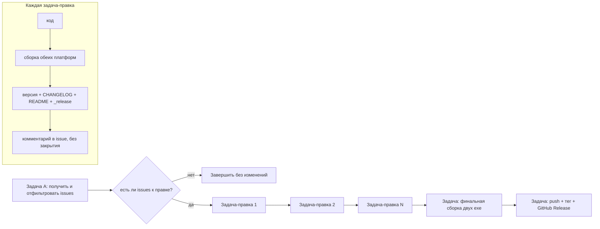

# План: исправление открытых issues → версионирование → сборка → релиз

**Репозиторий:** `sivatorov/ConfigurationManagement` (ветка `main`)
**Проект:** C#/.NET 10; Windows = WPF (`net10.0-windows`, `win-x64`); Linux = Avalonia 11 (`net10.0`, `linux-x64`)
**Текущая версия:** `0.3.7.14` (задана в 4 полях [`Configuration Management.csproj`](Configuration%20Management/Configuration%20Management.csproj))
**Требование ТЗ:** каждый крупный пункт процесса — отдельная задача через `new_task` в режиме `Code`; планирование/декомпозиция — режим Архитектора.

> Отличие от предыдущего плана (`issue-fix-release-plan.md` на версии 0.3.6.79):
> 1. **Issues не закрываем** — только комментируем (в старом плане было «закрыть»).
> 2. Номера issues и версия устарели — список открытых issues перечитывается заново.
> 3. Критерий отбора: **нет комментариев ИЛИ последний комментарий НЕ от автора (`sivatorov`)**.

---

## 0. Инварианты (общие правила для ВСЕХ задач)

1. Перед стартом: `git status` (чистое дерево), `git remote -v`, `gh auth status`.
2. Версия живёт **только** в 4 полях `Configuration Management.csproj`:
   `<Version>`, `<AssemblyVersion>`, `<FileVersion>`, `<InformationalVersion>` (сейчас `0.3.7.14`).
   `AssemblyInfo.cs` и `VersionInfo.cs` **не трогаем**.
3. После **каждой** правки кода версия поднимается монотонно на единицу в последней части
   (`0.3.7.14 → 0.3.7.15 → …`) с **обязательным** обновлением:
   - запись в верх `CHANGELOG.md` (Keep a Changelog, `## [0.3.7.1X] — <дата>`);
   - бейдж версии в `README.md` (строка 3);
   - заметка `_release/<версия>.md`.
4. После каждой правки — **комментарий к issue** через `gh issue comment <n>`
   с формулировкой «Исправлено в <версия>: …». **Issue НЕ закрываем.**
5. Обе платформы обязаны собираться после каждой правки (см. §4).
6. Итоговый релиз использует финальную версию после всех правок.
7. Артефакты `dist/`, `bin/`, `obj/` — вне git (`.gitignore` / `.codeassistantignore`).

---

## 1. Работа с GitHub issues и их проверка

### 1.1 Инструменты
- **`gh` CLI** (GitHub CLI) — приоритет: удобен для issues/комментариев/релизов.
- **GitHub REST API** (курлом/скриптом) — резерв и для точного анализа JSON.

### 1.2 Получение списка открытых issues (Задача A)
```bash
# Все открытые issues с телами и метаданными:
gh issue list --repo sivatorov/ConfigurationManagement --state open \
  --limit 100 --json number,title,body,comments,createdAt,updatedAt \
  > issues_open.json
```
(альтернатива REST: `GET /repos/sivatorov/ConfigurationManagement/issues?state=open&per_page=100`)

### 1.3 Фильтрация по критерию (Задача A)
Для каждого открытого issue получить комментарии:
```bash
gh api repos/sivatorov/ConfigurationManagement/issues/N/comments \
  --jq '[.[].user.login]'
```
**Критерий включения** (хотя бы одно):
- комментариев **нет** → база для правки — **описание issue**;
- последний комментарий **НЕ от `sivatorov`** → база для правки — **последний(ие) комментарии не от автора**.

**Исключаются:** последний комментарий принадлежит `sivatorov` (уже обработан/автор в курсе).

**Выход Задачи A** — CSV/таблица в `issues_selected.md`:
`number | title | comments count | last author | base for fix (description / comment author+text)`.

> Номера issues будут актуальными на момент запуска (текущий набор далеко за #233) —
> план правок не «зашиваем» заранее, а формируем на основе свежего отчёта.

---

## 2. Процесс исправления и версионирования (цикл на каждую правку)

### 2.1 Поток задачи-правки (внутри одной `new_task` Code)
```
1. Прочитать issue (тело + комментарии) → определить суть правки.
2. Найти затронутые файлы (по структуре проекта и прошлым правкам в CHANGELOG).
3. Внести код, устраняющий проблему.
4. Собрать обе платформы (см. §4). Если регрессия — вернуться к п.3.
5. Поднять версию в csproj (0.3.7.X → 0.3.7.X+1).
6. Обновить CHANGELOG.md (верх) + README.md (бейдж) + _release/<версия>.md.
7. Закоммитить осмысленным сообщением с привязкой к № issues.
8. Добавить комментарий в issue: "Исправлено в <версия>: …".
   ❗ Issue НЕ закрывать.
```

### 2.2 Отслеживание версии
- Единственный источник истины — `csproj` (4 поля).
- Монотонное наращивание последней части; номер не повторяется.
- Перед каждой правкой читаем текущую версию из csproj, после поднятия — сверяем
  согласованность `csproj == CHANGELOG == README == _release` перед коммитом.

---

## 3. Документация (форматы)

- **CHANGELOG.md** — Keep a Changelog; новая запись всегда вверху:
  `## [0.3.7.1X] — YYYY-MM-DD`, секции «Добавлено»/«Исправлено», ссылка на issue.
- **README.md** — обновить бейдж версии на строке 3 (`Версия-0.3.7.1X`).
- **_release/<версия>.md** — заметка к релизу (структура как `_release/0.3.7.14.md`).

---

## 4. Сборка исполняемых файлов

### 4.1 Windows (Windows-хост)
```powershell
cd "Configuration Management"
.\build-windows-single-file.ps1        # Release, RID win-x64
```
Результат: `dist/win-x64/ConfigurationManagement.exe` (один single-file .exe).

### 4.2 Linux (кросс-сборка из Windows)
```powershell
cd "Configuration Management"
.\build-linux-single-file.ps1          # ForceLinux=true, RID linux-x64
```
Результат: `dist/linux-x64/ConfigurationManagement`.

Альтернативы: `.sh` на реальном Linux; либо CI-публикация Linux-артефакта
автоматически при push тега (`release.yml` собирает `build-linux-single-file.sh`
и прикрепляет asset к Release).

### 4.3 Быстрая проверка после правки (до publish)
```powershell
dotnet build "Configuration Management/Configuration Management.csproj"
dotnet build "Configuration Management/Configuration Management.csproj" -p:ForceLinux=true
```

---

## 5. Публикация и создание релиза

### 5.1 Коммиты и push
```bash
git add "Configuration Management/..." CHANGELOG.md README.md "_release/<версия>.md"
git commit -m "fix(#N): краткое описание"
git push origin main
```

### 5.2 Тег и Release
```bash
git tag v0.3.7.<FINAL>
git push origin v0.3.7.<FINAL>
gh release create v0.3.7.<FINAL> \
  "Configuration Management/dist/win-x64/ConfigurationManagement.exe" \
  "Configuration Management/dist/linux-x64/ConfigurationManagement" \
  --title "0.3.7.<FINAL>" \
  --notes "$(cat _release/0.3.7.<FINAL>.md)"
```
Учесть конфликт с CI `release.yml` (добавляет Linux-артефакт; `overwrite: true` допустимо).

---

## 6. Архитектура работ (диаграмма потока)



---

## 7. Декомпозиция на отдельные задачи (каждая — `new_task`, режим `Code`)

| № | Задача (`new_task`) | Режим | Вход | Выход |
|---|---------------------|-------|------|-------|
| A | Предусловия + сбор и фильтрация issues | code | репозиторий | `issues_selected.md` (отчёт), чистое дерево, `gh` авторизован |
| 1 | Правка issue №1 (база — описание/комментарий) | code | отчёт Задачи A | код, версия, CHANGELOG/README/_release, комментарий в issue |
| 2 | Правка issue №2 | code | отчёт | то же |
| … | … по одной задаче на каждый отобранный issue | code | отчёт | то же |
| N | Последняя правка | code | отчёт | то же |
| B | Финальная сборка 2 исполняемых файлов | code | итоговый код | `dist/win-x64/ConfigurationManagement.exe`, `dist/linux-x64/ConfigurationManagement` |
| C | Публикация и GitHub Release | code | версия + артефакты | тег `v<версия>`, Release с обоими артефактами |

**Замечания:**
- Задачи 1…N запускаются последовательно (версия наращивается монотонно).
- Если issues-правок много и они связаны общим модулем — допустимо объединять несколько
  issues в одну задачу-правку (как «группы»), но каждая получает свой комментарий с версией.
- Задача C (релиз) выполняется **после** финальной сборки.

---

## 8. Риски и критерии готовности

### Риски
- Нет авторизации `gh` → предусловие падает; нужен `gh auth login` или `GITHUB_TOKEN`.
- Недостаточно данных в issue без комментариев → запросить уточнение у пользователя, правка по лучшему диагнозу.
- Комментарий требует вложения/лога → скачать и проанализировать, при невозможности — усилить логирование.
- Регрессии на одной платформе → обязательная сборка обеих платформ после каждой правки.
- Расхождение версий между csproj/CHANGELOG/README/тегом → вести централизованно, сверять перед коммитом.
- Конфликт с CI `release.yml` при создании Release → `overwrite: true` допустимо.

### Критерии готовности
- Все отобранные issues исправлены и получили комментарий с номером версии; **ни один не закрыт**.
- Версия согласована в csproj / CHANGELOG / README / _release / теге.
- Обе платформы собираются; в `dist/` ровно один `.exe` и один бинарник Linux.
- Изменения в `main`; создан GitHub Release `v<версия>` с обоими артефактами.