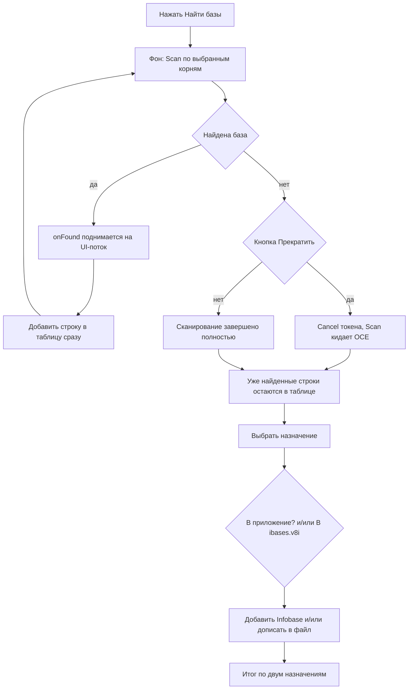

# План: «Доработка поиска потерянных и забытых баз + разбиение вкладки "Базы" в настройках»

**Репозиторий:** `sivatorov/ConfigurationManagement` (ветка `main`)
**Проект:** C#/.NET; Windows = WPF (`net10.0-windows`, `win-x64`); Linux = Avalonia 11 (`net10.0`, `linux-x64`)
**Текущая версия:** `0.3.7.37` (задана в 4 полях [`Configuration Management.csproj`](Configuration%20Management/Configuration%20Management.csproj))
**Целевая версия:** `0.3.7.38`
**Требование ТЗ:** каждый крупный пункт — отдельная задача через `new_task`; планирование/декомпозиция — режим Архитектора.

---

## 0. Исходное состояние (что уже есть)

Диалог «Поиск потерянных и забытых баз 1С на дисках» реализован в issue #247:
- WPF: [`Views/FindLostBasesWindow.xaml`](Configuration%20Management/Views/FindLostBasesWindow.xaml) + [`Views/FindLostBasesWindow.xaml.cs`](Configuration%20Management/Views/FindLostBasesWindow.xaml.cs)
- Avalonia: [`Views/FindLostBasesWindow.Avalonia.cs`](Configuration%20Management/Views/FindLostBasesWindow.Avalonia.cs)
- Сканер: [`Services/InfobaseDiskScanner.cs`](Configuration%20Management/Services/InfobaseDiskScanner.cs)
- Строка-модель: [`ViewModels/FoundBaseRowViewModel.cs`](Configuration%20Management/ViewModels/FoundBaseRowViewModel.cs)
- Точка входа WPF: [`Views/SettingsWindow.Platforms.cs`](Configuration%20Management/Views/SettingsWindow.Platforms.cs) (`OnFindLostBases_Click`)
- Точка входа Avalonia: [`Views/SettingsWindow.Avalonia.cs`](Configuration%20Management/Views/SettingsWindow.Avalonia.cs:1892)

### Выявленные проблемы (по итогам анализа кода)

1. **Криво работает прекращение поиска + теряются уже найденные базы.**
   В обоих окнах результат получается только после полного завершения сканирования:
   `var results = await Task.Run(() => InfobaseDiskScanner.Scan(roots, token, OnScanProgress), token);`
   Затем строки добавляются в таблицу разом (`foreach (var found in results)`). Сервис
   [`Scan`](Configuration%20Management/Services/InfobaseDiskScanner.cs:42) копит результаты во внутреннем
   списке и возвращает их **только в конце**; при отмене (`_cts.Cancel()`) бросает
   `OperationCanceledException`, и уже найденные базы не возвращаются. Поэтому:
   - если пользователь жмёт «Прекратить», ничего из уже найденного не показывается;
   - нужна инкрементальная отдача: каждая найденная база сразу добавляется в таблицу,
     а прерывание просто перестаёт добавлять новые (уже найденные остаются видимыми).

2. **Нельзя выбрать и добавить базы (WPF).**
   В [`FindLostBasesWindow.xaml`](Configuration%20Management/Views/FindLostBasesWindow.xaml:152)
   у `DataGrid` стоит `IsReadOnly="True"`. При read-only DataGrid чекбоксы в колонке-шаблоне
   не переключаются → кнопка «Добавить в список баз» никогда не активируется
   (`UpdateAddEnabled` зависит от `r.IsChecked`).

3. **Нет «Отметить все / Снять все» для найденных баз.**
   Есть только для выбора дисков (`OnDriveCheckAll`/`OnDriveCheckNone`). Нужен аналог для таблицы баз.

4. **Нет поиска по конкретному каталогу.**
   Корни берутся только из `InfobaseDiskScanner.EnumerateSearchRoots()` (диски Windows /
   точки монтирования Linux). Нужно дать пользователю возможность указать произвольный каталог.

5. **Добавление только в программу.**
   Кнопка «Добавить» создаёт `Infobase` и вызывает `_addBase(ib)` (добавляет в список приложения),
   но не пишет в ibases.v8i. Требуется выбор: добавить в программу, в ibases.v8i, или в оба места.

6. **Вкладка «Базы» в настройках — один длинный список.**
   В отличие от вкладки «Отображение» (подвкладки «Значки/Колонки/Панели/Статус/Шрифт»),
   вкладка «Базы» — один `ScrollViewer` со всеми GroupBox подряд
   ([`SettingsWindow.xaml`](Configuration%20Management/Views/SettingsWindow.xaml:1526),
   [`SettingsWindow.Avalonia.cs`](Configuration%20Management/Views/SettingsWindow.Avalonia.cs:1716)).
   Требуется разбить на горизонтальные подвкладки.

---

## 1. Ключевые архитектурные решения

### 1.1. Инкрементальная отдача найденных баз (задачи 1 и 4)

Меняем сигнатуру `InfobaseDiskScanner.Scan`, чтобы каждая найденная база передавалась
обратным вызовом сразу:

```csharp
public static List<FoundFileBase> Scan(
    IReadOnlyList<string> roots,
    CancellationToken cancellationToken,
    Action<int, int>? progress = null,
    Action<FoundFileBase>? onFound = null)   // НОВОЕ: вызывается для каждой найденной базы
```

Внутри `Walk` при добавлении в `ctx.Results` также вызываем `onFound?.Invoke(found)`.
В UI:
- обратный вызов `onFound` поднимается на UI-поток (`Dispatcher.BeginInvoke` / `Dispatcher.UIThread.Post`),
  создаёт `FoundBaseRowViewModel`, добавляет строку в `_rows` и сразу обновляет таблицу;
- `Scan` продолжает возвращать полный список для совместимости (при отмене уже добавленные
  в UI строки остаются; `OperationCanceledException` обрабатывается как «Прекращено», но не чистит таблицу);
- если отмена происходит до первого результата — таблица остаётся пустой с сообщением «Поиск прекращён».

### 1.2. «Отметить все / Снять все» для найденных баз (задача 2)

Добавить две кнопки над таблицей (по аналогии с кнопками для дисков):
- WPF: кнопки в панели заголовка таблицы либо рядом с заголовком колонки-флажка;
- Avalonia: в `BuildHeaderGrid()` добавить кнопки.

Логика: `_rows.ForEach(r => r.IsChecked = true/false)` только для строк с `NotInApp == true`
(базы, уже присутствующие в приложении, добавлять нельзя). После этого
`UpdateCheckedHeader()` и `UpdateAddEnabled()`.

### 1.3. Поиск по конкретному каталогу (задача 3)

В верхней панели добавить поле ввода пути + кнопку «Обзор» (`OpenFolderDialog`) +
кнопку «Добавить». Выбранный каталог добавляется в список корней поиска (отдельный
`TextBox`/`TextBlock` с возможностью удаления), затем участвует в `GetSelectedRoots()`.
Проверка существования каталога перед запуском сканирования.

Реализация общая для обеих платформ; папка выбирается через существующие механизмы
выбора каталога (в WPF — `Microsoft.Win32.OpenFolderDialog` / аналог, в Avalonia —
`_viewModel.PickFolder` или `StorageProvider`).

### 1.4. Добавление в программу и/или ibases.v8i (задача 4)

В нижней панели добавить два флажка выбора назначения:
- «Добавить в список приложения»;
- «Добавить в ibases.v8i».

Возможны комбинации (оба/одно из). Обработчик `OnAdd_Click`:
- для каждой отмеченной строки создаёт `Infobase`;
- если отмечено «в приложение» — вызывает `_addBase(ib)`;
- если отмечено «в ibases.v8i» — дописывает запись в файл ibases.v8i.

Для записи в ibases.v8i использовать существующий `IbasesV8iExporter` или добавить
в него новый публичный метод «добавить одну/список баз в файл» (например
`AddInfobasesToFile(string filePath, IEnumerable<Infobase> infobases, IEnumerable<Group> groups)`),
который читает существующий файл, добавляет недостающие записи и обновляет уже
существующие (по имени), **не удаляя и не трогая чужие записи** (в отличие от полного
`Export`, который синхронизирует двусторонне). Файл по умолчанию — `IbasesV8iImporter.FindDefaultPath()`.

**Решение пользователя (Задача 4):** «Только дописывать/обновлять выбранные базы, чужие
записи в ibases.v8i не трогать».

Итоговое сообщение: «Добавлено в приложение: X, в ibases.v8i: Y, уже в списке: Z».

### 1.5. Разбиение вкладки «Базы» (задача 5)

Взять за образец подвкладки «Отображения»:
- WPF: найти в [`SettingsWindow.xaml`](Configuration%20Management/Views/SettingsWindow.xaml) паттерн
  `TabControl` с подвкладками (раздел «Отображение») и применить к вкладке «Базы».
- Avalonia: в [`SettingsWindow.Avalonia.cs`](Configuration%20Management/Views/SettingsWindow.Avalonia.cs)
  используется `SubTab(...)` + `TabControl SettingsSubTabControl` (пример — строки 1309-1318).

Разбить текущее содержимое вкладки «Базы» на подвкладки, например:
- «Список баз» (экспорт/импорт/StartManager/детект/поиск потерянных/очистка истории/глубина истории);
- «Каталоги шаблонов»;
- «Обслуживание» (удаление отсутствующих, завершение процессов, опасные операции);
- «Синхронизация с ibases.v8i» (режим, файл, триггер, резервные копии).
При необходимости — согласовать состав подвкладок с пользователем.

### 1.6. Версионирование и документация (задача 6)

По инвариантам [`plans/issue-fix-release-workflow.md`](plans/issue-fix-release-workflow.md):
1. Версия только в 4 полях [`csproj`](Configuration%20Management/Configuration%20Management.csproj):
   поднять до `0.3.7.38`.
2. Обновить `CHANGELOG.md` (раздел `## [0.3.7.38] — 2026-09-16`, «Исправлено»/«Добавлено»).
3. Обновить бейдж версии в `README.md` (строка 3).
4. Создать заметку `_release/0.3.7.38.md`.
5. Проверить сборку обеих платформ.

---

## 2. Декомпозиция на отдельные задачи (каждая — `new_task`, режим `Code`)

| № | Задача | Результат |
|---|--------|-----------|
| 0 | Анализ + план + декомпозиция (архитектор) | настоящий документ |
| 1 | **Инкрементальная отдача + корректное прекращение** поиска (WPF + Avalonia): сигнатура `Scan` + обработчики окон | при прерывании уже найденные базы остаются в таблице |
| 2 | **«Отметить все / Снять все»** для найденных баз (WPF + Avalonia) | кнопки управления выбором строк |
| 3 | **Поиск по конкретному каталогу** (WPF + Avalonia): поле + обзор + добавление корня | возможность указать произвольный каталог |
| 4 | **Выбор назначения при добавлении**: в программу и/или ibases.v8i (WPF + Avalonia) + метод записи в ibases.v8i | добавление в оба места и по отдельности |
| 5 | **Разбиение вкладки «Базы»** на горизонтальные подвкладки (WPF + Avalonia) | подвкладки вместо одного списка |
| 6 | **Версия 0.3.7.38 + CHANGELOG + README + _release** | документация и версия |
| 7 | **Сборка single-file Windows и Linux** | `dist/win-x64/*.exe`, `dist/linux-x64/ConfigurationManagement` |
| 8 | **GitHub push + релиз v0.3.7.38** | тег + Release с артефактами |

Задачи 1–5 выполняются последовательно (общие файлы `FindLostBasesWindow.*`,
`InfobaseDiskScanner.cs`). Задача 6 — после всех правок кода. Задачи 7–8 — после версии.

### Локализация
Новые ключи в `ru.json`/`en.json` (раздел `FindLostBases.*`):
- `FindLostBases.FoundAll` / `.FoundNone` — «Отметить все / Снять все» для найденных баз;
- `FindLostBases.Button.AddFolder` / `.FolderBrowse` / `.FolderPlaceholder` — добавление каталога;
- `FindLostBases.AddToApp` / `.AddToV8i` — флажки назначения;
- `FindLostBases.AddedFormatSplit` — итог по двум назначениям;
- ключи подвкладок `Settings.Bases.Subtab.*`.

### Сборка
```powershell
cd "Configuration Management"
.\build-windows-single-file.ps1      # → dist/win-x64/ConfigurationManagement.exe
.\build-linux-single-file.ps1        # → dist/linux-x64/ConfigurationManagement
```

### Публикация
```bash
git add -A
git commit -m "feat: доработка поиска потерянных баз и разбиение вкладки Базы (#251)"
git push origin main
git tag v0.3.7.38
git push origin v0.3.7.38
gh release create v0.3.7.38 \
  "Configuration Management/dist/win-x64/ConfigurationManagement.exe" \
  "Configuration Management/dist/linux-x64/ConfigurationManagement" \
  --title "0.3.7.38" --notes "$(cat _release/0.3.7.38.md)"
```

---

## 3. Схема работы (инкрементальный поиск и добавление)



---

## 4. Риски и замечания
- **Чувствительность к потоку:** `onFound` вызывается из фонового потока — обязателен переход
  на UI-поток; массовые обновления таблицы могут тормозить UI — рекомендуется дебаунс/пакетное
  обновление `ItemsSource` (например, добавлять в `List<FoundBaseRowViewModel>` и рефрешить раз в N мс).
- **Совместимость `Scan`:** возврат полного списка сохраняем, чтобы не сломать другие вызовы.
- **Запись в ibases.v8i:** нельзя использовать полный `Export` (он удаляет базы, которых нет в
  приложении) — нужен отдельный метод «только добавить/обновить», не трогающий чужие записи.
- **Подвкладки «Базы»:** состав подвкладок может отличаться между платформами — привести к общему виду.