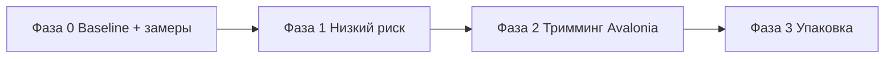

# План оптимизации размера исполняемого файла

> Проект: «Управление конфигурациями 1С» (.NET 10, WPF на Windows / Avalonia на Linux).
> Дата анализа: 2026-09-17. Текущая версия: `0.3.8.9`.
> Цель: уменьшить размер self-contained single-file артефактов для Windows и Linux
> без потери функциональности. **В этот документ не вносятся правки кода** — только анализ и план.

---

## 1. Исходное состояние

### 1.1. Профиль публикации

Свойства задаются в двух местах:
- в [`Configuration Management.csproj`](../Configuration%20Management/Configuration%20Management.csproj) — блок `Release` (строки 71–83);
- в скриптах [`build-windows-single-file.ps1`](../Configuration%20Management/build-windows-single-file.ps1:60), [`build-linux-single-file.sh`](../Configuration%20Management/build-linux-single-file.sh:76) — те же параметры передаются через `-p:`.

Текущие значения:

| Свойство | Значение | Комментарий |
|----------|----------|-------------|
| `TargetFramework` | `net10.0-windows` (Win) / `net10.0` (Linux) | зависит от ОС / `ForceLinux` |
| `SelfContained` | `true` | включён |
| `PublishSingleFile` | `true` | включён |
| `IncludeNativeLibrariesForSelfExtract` | `true` | нативные библиотеки вкладываются в exe |
| `EnableCompressionInSingleFile` | `true` | managed-код сжимается (Brotli) |
| `PublishReadyToRun` | `false` | R2R **выключен** — размер уже снижен |
| `DebugType` | `embedded` | `.pdb` не выносится наружу |
| `PublishTrimmed` | **не задано** | тримминг выключен |
| `InvariantGlobalization` | **не задано** | ICU-данные входят в состав |
| `TrimMode` / `TrimmerRootAssembly` | — | — |

**Вывод:** проект уже использует базовые «безопасные» экономии (compression, без R2R, embedded pdb). Основной неиспользованный резерв — тримминг managed-кода и глобализация (ICU).

### 1.2. Зависимости (источники размера)

Общие (`csproj:116`):
- `Microsoft.Extensions.DependencyInjection` 9.0.0 — небольшой вклад.

Windows-only (`csproj:134–139`):
- `MaterialDesignThemes` 5.2.1 — крупный: словари стилей, иконки PackIcon, ресурсы.
- `System.Management` 8.0.0 — средний (WMI `Win32_Process`).

Linux-only (Avalonia, `csproj:153–162`):
- `Avalonia` 11.3.20 — ядро UI.
- `Avalonia.Desktop` 11.3.20 — платформенные бэкенды (X11/Wayland, GL).
- `Avalonia.Themes.Fluent` 11.3.20 — словари Fluent-стилей (крупный).
- `Avalonia.Fonts.Inter` 11.3.20 — встроенный шрифт Inter (сотни КБ–МБ).
- `Avalonia.Diagnostics` 11.3.20 — `PrivateAssets=all`, **в publish не попадает**.

Причина крупного размера обоих артефактов — **self-contained**: в exe вложен весь .NET runtime + нативные библиотеки (для Linux также libSkiaSharp, GTK-нативные зависимости Avalonia; для Windows — весь WPF-runtime и MaterialDesignThemes).

Ориентировочный порядок величины (типично для self-contained single-file с compression):
- **Windows/WPF**: ~120–180 МБ (WPF-рантайм тяжёлый).
- **Linux/Avalonia**: ~55–90 МБ (Avalonia легче, но + Skia/native-зависимости).

> Оценки требуют замера baseline до начала работ (см. Раздел 6). Точные числа зависят от версии SDK и состава нативных библиотек.

---

## 2. Рефлексия и риски тримминга (ключевой фактор)

Перед включением тримминга важно понимать, что рефлексия в проекте значительна:

- **WPF**: `DependencyProperty.Register(...)` во множестве контролов ([`HotkeyBox.cs:28`](../Configuration%20Management/Controls/HotkeyBox.cs:28), [`ColorPickerControl.xaml.cs:48`](../Configuration%20Management/Controls/ColorPickerControl.xaml.cs:48), `WindowChromeHelper.cs:52` и др.), загрузка XAML по `typeof`, `DependencyPropertyHelper`, привязки `RelativeSourceMode.FindAncestor` + `AncestorType = typeof(...)`.
- **Avalonia**: `ControlTheme(typeof(Button))`, `StyleKeyOverride => typeof(TreeView)`, `FuncTreeDataTemplate(typeof(object), ...)` в нескольких окнах, генерация XAML-кода через `AvaloniaXamlLoader.Load`.
- **COM late-binding (только Windows)**: `Activator.CreateInstance(type)` + `InvokeMember(...)` в [`ComReadHost.cs`](../Configuration%20Management/Services/ComReadHost.cs:1195) и [`OneCComConnector.cs`](../Configuration%20Management/Services/OneCComConnector.cs:714) — это **внешние COM-объекты 1С**, они не попадают в тримминг и не ломаются им.
- **System.Text.Json**: сериализация настроек/моделей ([`InfobaseRepository.cs:14`](../Configuration%20Management/Services/InfobaseRepository.cs:14), [`ColorScheme.cs:317`](../Configuration%20Management/Models/ColorScheme.cs:317)) — STJ поддерживает тримминг через source generation, но в классическом режиме с рефлексией может потребовать `JsonSerializerContext`.

**Критический вывод:**

- **WPF НЕ поддерживает официальный тримминг**. Microsoft не рекомендует `PublishTrimmed` для WPF-приложений: ломаются DependencyProperty-рефлексия, динамическая загрузка BAML/ресурсов и прочие сценарии. **Для Windows-артефакта тримминг не планировать** — фокус на других мерах.
- **Avalonia поддерживает тримминг**, но требует осторожной настройки корневых сборок (`TrimmerRootAssembly`) и тщательного регрессионного тестирования из-за `typeof`-рефлексии в темах/шаблонах и `FuncTreeDataTemplate`.

---

## 3. Дорожная карта оптимизации

### 3.1. Принцип стадийности

Изменения разбиты на **три фазы** по уровню риска. Каждая фаза — отдельная версия (см. Раздел 5), после каждой — контрольные сборки обеих платформ и прогон ключевых сценариев.

### 3.2. Фаза 0 — Замер базового размера (обязательна)

До любых правок зафиксировать текущий размер:
- `dist/win-x64/ConfigurationManagement.exe`
- `dist/linux-x64/ConfigurationManagement`

Использовать оба скрипта сборки как есть. Записать размеры в таблицу ниже (станет эталоном сравнения).

### 3.3. Фаза 1 — Меры низкого риска (безопасно, обе платформы)

#### 1.1. `InvariantGlobalization=true`
- **Что**: исключает ICU-данные и переход на инвариантную культуру для форматирования дат/чисел/строк.
- **Где**: общий `<PropertyGroup>` в csproj (применимо к обеим конфигурациям) + передать `-p:InvariantGlobalization=true` в оба скрипта (поскольку они явно переопределяют publish-параметры).
- **Ожидаемый эффект**: экономия до ~10–30 МБ в self-contained (ICU — крупный компонент). При single-file + compression реальный выигрыш меньше, но заметен (обычно ~5–15 МБ).
- **Риски**: средние. Приложение локализовано (ru/en) и может форматировать даты/числа в UI. С `InvariantGlobalization` форматирование станет инвариантным (en-US-ish). Требуется проверить: колонки «Размер», «Последний запуск», экспорт/импорт `ibases.v8i`, окна настроек. Если важна локальная культура — рассмотреть `InvariantGlobalization` только для Linux-артефакта или добавить явную культуру в приложении.
- **Решение о включении**: рекомендуется **включить**, но только после ручной проверки дат/чисел. При сомнении — флаг-переключатель `-p:` для быстрого возврата.

#### 1.2. Подтвердить, что `EnableCompressionInSingleFile` действительно применяется к обоим артефактам
- Скрипты уже передают `-p:EnableCompressionInSingleFile=true`. Проверить фактический размер против варианта без сжатия — если сжатие уже активно, ничего не делать.

#### 1.3. Проверить состав нативных библиотек для Linux (`IncludeNativeLibrariesForSelfExtract`)
- Убедиться, что в Linux-артефакт не попадают лишние бэкенды Avalonia (например, ненужные GPU-драйверы). Avalonia сам подбирает бэкенды в рантайме; жёсткое исключение платформ требует ручной настройки `SkiaOptions`/подключения конкретных `Avalonia.*` пакетов и **не рекомендуется** без острой необходимости (высокий риск потери поддержки окружений).

#### 1.4. Шрифт Inter (Linux)
- `Avalonia.Fonts.Inter` встроен через `.WithInterFont()` ([`Program.cs:25`](../Configuration%20Management/Program.cs:25)). Полное удаление сэкономит немного (сотни КБ), но изменит типографику и может ухудшить рендер кириллицы.
- **Рекомендация**: НЕ удалять в рамках этой задачи; отметить как опцию на будущее (субсеттинг шрифта — сложнее, отдельная задача).

**Итог Фазы 1**: низкий риск, ожидаемая экономия ~5–20 МБ преимущественно за счёт глобализации. Применимо к обеим платформам, но тримминга не включает.

### 3.4. Фаза 2 — Тримминг Avalonia (Linux, средний/высокий риск)

Применимо **только к Linux/Avalonia** артефакту. WPF-тримминг исключён (см. Раздел 2).

- `PublishTrimmed=true` + `TrimMode=partial` (безопасный старт: обрезаются только «очевидно неиспользуемые» части) для Linux-ветки.
- Добавить `TrimmerRootAssembly` для сборок проекта и ключевых зависимостей, чтобы предотвратить вырезание типов, используемых через рефлексию:
  - сборки приложения (модели/ViewModels/сервисы);
  - `Avalonia.Themes.Fluent`, `Avalonia.Fonts.Inter` (ресурсы, загружаемые динамически).
- Рассмотреть **`System.Text.Json` source generation** (`JsonSerializerContext`) для моделей сериализации, если тримминг начнёт вырезать свойства. Пока только оценить — внедрять, если возникнут сбои десериализации.
- Avalonia официально публикует trimmable-совместимость; полный `TrimMode=full` применять только после успешного `partial` и тестов.

**Ожидаемый эффект**: сокращение managed-части на ~30–50%; на фоне нативных библиотек и runtime суммарный выигрыш Linux-артефакта обычно ~10–25 МБ.

**Риски** (требуют регрессионного теста):
- сломанные темы/шаблоны (рефлексия `typeof` в `ControlTheme`/`StyleKeyOverride`);
- `FuncTreeDataTemplate(typeof(object), ...)` в окнах дерева;
- потеря свойств при десериализации STJ;
- редкие краши в рантайме, не видные на этапе сборки (нужен прогон всех окон на Linux).

**Гейт**: если после `partial` + корневых сборок приложение стабильно проходит ключевые сценарии (открытие главного окна, темы, диалоги, импорт/экспорт, работа с базой) — зафиксировать выигрыш. Иначе — оставить `partial` с минимальным набором корней или вернуть тримминг к выключенному.

### 3.5. Фаза 3 — Дополнительная упаковка (необязательно, эксперимент)

- **UPX** итогового single-file exe: может дополнительно сжать (нередко −20–40%), но **рискованно** для .NET single-file (может сломать распаковку bundle/нативных библиотек) и антивирусных детектов. Только эксперимент на отдельной ветке, без включения в основной конвейер.
- **NativeAOT для Avalonia/Linux** (будущая возможность): способно дать single-file ~15–30 МБ, но требует большой работы (совместимость Avalonia с AOT, ограничения рефлексии/COM отсутствуют на Linux, но темы/шаблоны и STJ требуют AOT-дружественных паттернов). В этой задаче — только отметка как roadmap, не реализация.

---

## 4. Сводная оценка эффекта и рисков

| # | Мера | Платформа | Эффект (оценка) | Риск | Приоритет |
|---|------|-----------|-----------------|------|-----------|
| 0 | Baseline-замер | обе | — (эталон) | — | обязателен |
| 1.1 | `InvariantGlobalization` | обе | ~5–20 МБ | средний (культура) | высокий |
| 1.2 | проверка compression | обе | уже активно | низкий | проверить |
| 1.4 | шрифт Inter | Linux | сотни КБ | низкий | не делать сейчас |
| 2 | Тримминг Avalonia (`partial`+roots) | Linux | ~10–25 МБ | средний/высокий | средний |
| 3 | UPX / NativeAOT | — | значительный | высокий | низкий (эксперимент) |

> Все цифры — ориентировочные. После Фазы 0 заполнить фактическими.

---

## 5. Порядок реализации и версионирование

### 5.1. Конвенция версии (обязательна после каждой правки)

По сложившейся практике релизов (см. [`issue-fix-release-plan.md`](issue-fix-release-plan.md), [`merge-0.3.7.14-release-plan.md`](merge-0.3.7.14-release-plan.md)) после каждого изменения нужно:

1. **csproj**: поднять версию в четырёх полях `<Version>`, `<AssemblyVersion>`, `<FileVersion>`, `<InformationalVersion>` ([`csproj:62–65`](../Configuration%20Management/Configuration%20Management.csproj:62)).
2. **`README.md`**: обновить бейдж версии на строке 3 (``).
3. **`CHANGELOG.md`**: добавить запись сверху в формате Keep a Changelog (`## [0.3.x.y] — <дата>`), с разделом «Версия» и пометкой о сборке обеих платформ.
4. **`_release/<версия>.md`**: создать заметку для GitHub Release (текст о размере/оптимизациях).

> На момент анализа папка `_release/` пуста или отсутствует — при необходимости создать. Текущая версия в csproj/README/CHANGELOG — `0.3.8.9`.

### 5.2. Порядок шагов

**Шаг 1 — Baseline.**
- Собрать обе платформы текущим кодом, зафиксировать размеры. Без изменения версии (это не правка, а замер).

**Шаг 2 — Фаза 1 (InvariantGlobalization).**
- Внести правку в csproj + оба скрипта сборки.
- Собрать обе платформы, замерить.
- Вручную проверить даты/числа/локализацию на обеих платформах.
- Версия `0.3.9.0` (или следующая свободная), CHANGELOG, README, `_release/`.
- Гейт: если культура сломалась критически — откат флага и решение (включать только для Linux либо не включать).

**Шаг 3 — Фаза 2 (Тримминг Avalonia), отдельная версия.**
- Включить `PublishTrimmed` + `TrimMode=partial` + `TrimmerRootAssembly` только для Linux-ветки (через условие `BuildLinux`).
- В скрипт [`build-linux-single-file.sh`](../Configuration%20Management/build-linux-single-file.sh:76) и его ps1-аналог передать соответствующие `-p:`.
- Windows-артефакт не трогать.
- Собрать Linux, замерить, прогнать ключевые сценарии.
- Версия, CHANGELOG, README, `_release/`.

**Шаг 4 (необязательно) — Фаза 3 эксперимент.**
- Только отдельная ветка/тег, в основной конвейер не включать без уверенности в стабильности.

---

## 6. Критерии приёмки

- Размер каждого артефакта зафиксирован до/после (таблица в Разделе 4 заполнена).
- Обе платформы собираются скриптами без ошибок; в `dist/` ровно один `.exe` и один бинарник Linux.
- Ключевые сценарии работают после каждой фазы:
  - запуск приложения, главное окно, смена темы;
  - диалоги (настройки, добавление/редактирование базы, поиск баз, очистка кэша);
  - локализация ru/en; форматирование дат/чисел/размеров;
  - импорт/экспорт `ibases.v8i`, работа с базой 1С (Windows: COM-агент);
  - автообновление.
- Версия согласована в csproj / README / CHANGELOG / `_release/`.

---

## 7. Решения «не делать сейчас» (зафиксировано)

- **Тримминг WPF** — не поддерживается официально, высока вероятность поломки рефлексии. Пропустить.
- **Удаление шрифта Inter** — экономия мала, риск для типографики. Отложить.
- **NativeAOT / UPX** — большой риск/усилия; только отдельный экспериментальный этап.
- **Жёсткое исключение бэкендов Avalonia** — риск потери поддержки окружений. Не делать без необходимости.